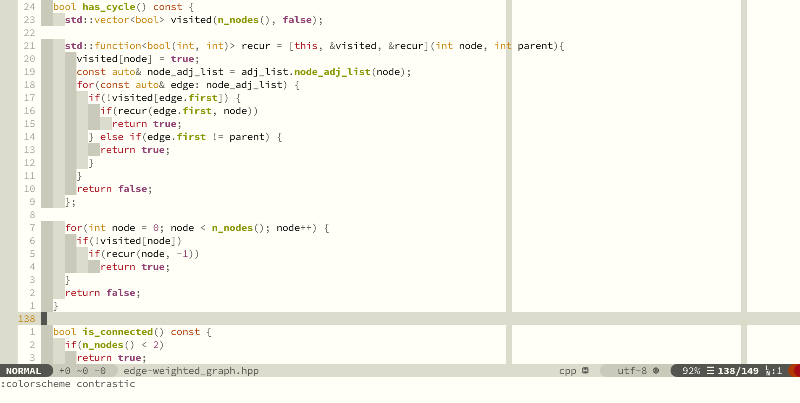
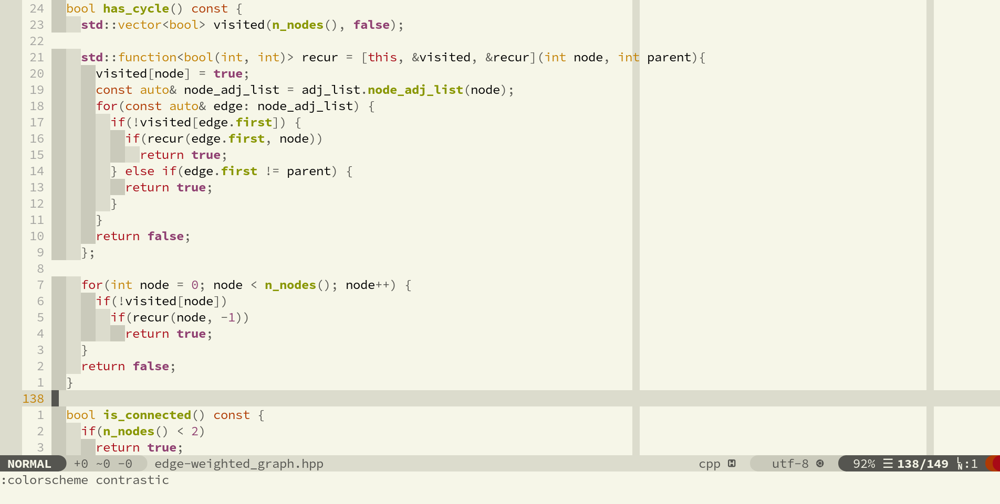

Contrastic is very heavily inspired by [gruvbox](https://github.com/morhetz/gruvbox) and can be called its fork in some sense.

Designed for easier code readability, this color scheme offers a contrasting palette with a slight lack of blue tones in the background colors.

# Content
-------

- [Main differences from gruvbox](#main-differences-from-gruvbox)
- [Palette](#palette)
- [Customizing](#customizing)
- [Killer feature](#killer-feature)
- [Screenshots](#screenshots)

# Main differences from gruvbox
-----------------------------

Most part of code is copypaste from [gruvbox](https://github.com/morhetz/gruvbox) with changing 'gruvbox' to 'contrastic'. Despite it, there are some differences in these two color schemes:

1. [Palette](#palette);
1. [Background change](#killer-feature) depending on the daytime: light at day and dark at night;
1. Hard contrast by default;
1. Set foreground color a bit pale to make it easier to distinguish words marked by LSP server (identifiers, functions, types, etc.) or as keywords;
1. Some improvements in C/C++ syntax highlighting:
  * Added support for [vim-lsp-cxx-highlight](https://github.com/jackguo380/vim-lsp-cxx-highlight) plugin;
  * Improved preprocessor highlighting;
1. Highlighting trailing whitespaces as errors;
1. Highlighting `TODO` more noticeably.

# Palette
-------

### Light palette


### Dark palette


See [screenshots](#screenshots) section for screenshots.

# Customizing
-----------

Most if the options are same as [gruvbox](https://github.com/morhetz/gruvbox) options and have the same default values (just change `gruvbox` to `highlighting`). Exceptions:

1. `g:contrastic_contrast_light(dark)` is `'hard'` by default;
1. Dynamic background changing options. See [here](#killer-feature) how to customize it.

# Killer feature
--------------

This color scheme can change background depending on time of the day. By default, it turns on light background from 8 A.M. to 8 P.M. and during other time it turns on dark background.

Here there are customization options with their default values:

- Enabling dynamic background (enabled by default). When set to `0` it doesn't turn off started timer but just prevents to start new timer, so it is preferably to use it in your .vimrc. To turn off an already started timer, use `ContrasticStopDynBg`.  
  ```
  let g:contrastic_enable_dyn_bg = 1 " set to 0 to turn off
  ```

- Set hours for turning on light background (in 24-hour format). Must be a list of two numbers less than 24 to work correctly.  
  ```
  let g:contrastic_light_bg_time = [ 8, 20 ]
  ```

- Set timer update time (in seconds).  
  ```
  ContrasticSetDynBgTimeout 60
  ```

- Stop dynamic highlighting. Stops running timer.  
  ```
  ContrasticStopDynBg
  ```
- Set background according to current time, but don't start timer.  
  ```
  ContrasticSetBg
  ```

# Screenshots
-----------

### Light background, hard contrast



### Light background, medium contrast



### Light background, soft contrast


### Dark background, hard contrast


### Dark background, medium contrast


### Dark background, soft contrast


